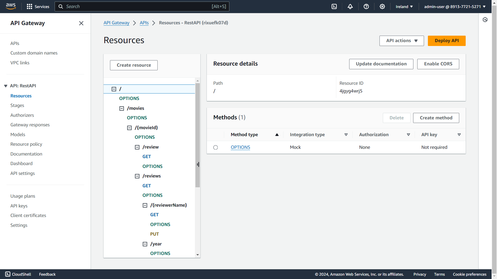
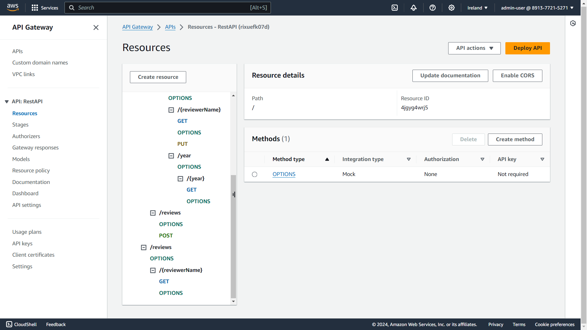
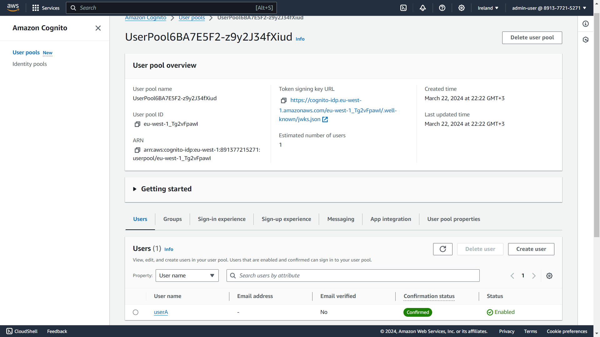

## Serverless REST Assignment.

__Name:__ Javid Moradi

__Video demonstration:__ [Demo Video](https://youtu.be/oMX7KWf1Spc)

This repository contains an implementation of a serverless REST API for the AWS platform. The CDK framework is used to provision its infrastructure. The API's domain context is movie reviews.

### API endpoints.
 
+ POST /movies/reviews - add a movie review.
+ GET /movies/{movieId}/reviews - Get all the reviews for a movie with the specified id.
+ GET /movies/{movieId}/reviews?minRate=n - Get all the reviews for the film with the specified ID whose rating was higher than the minRate.
+ GET /movies/{movieId}/reviews/{reviewerName} - Get the review for the movie with the specified movie ID and written by the named reviewer.
+ GET /movies/{movieId}/reviews/{year} - Get the reviews written in a specific year for a specific movie.
+ GET /reviews/{reviewerName} - Get all the reviews written by a specific reviewer.

### Authentication (if relevant).

### Independent learning (If relevant).

AWS documentation is used when necessary. Following are two examples of use cases of independent research and learning.
+ https://docs.aws.amazon.com/amazondynamodb/latest/developerguide/Query.KeyConditionExpressions.html
+ https://docs.aws.amazon.com/AWSJavaScriptSDK/v3/latest/client/dynamodb/command/PutItemCommand/
